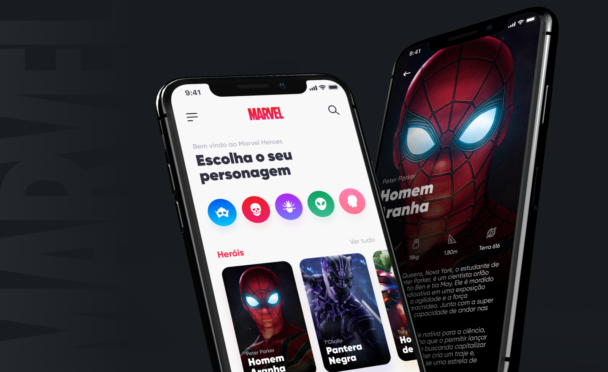
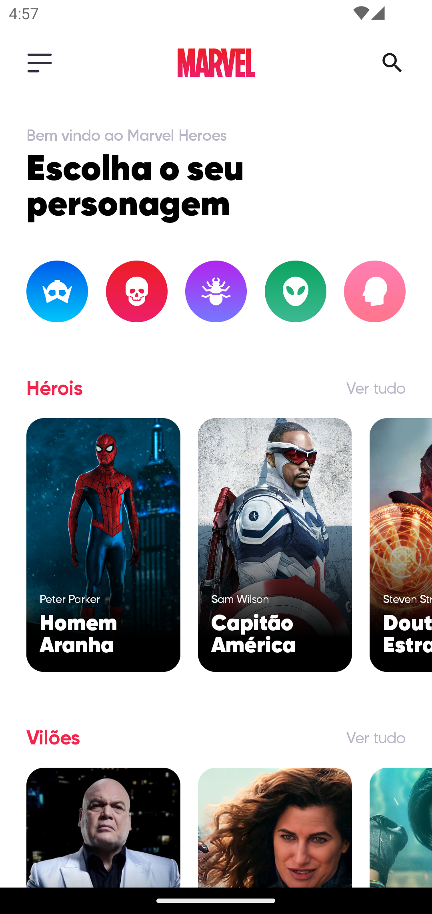
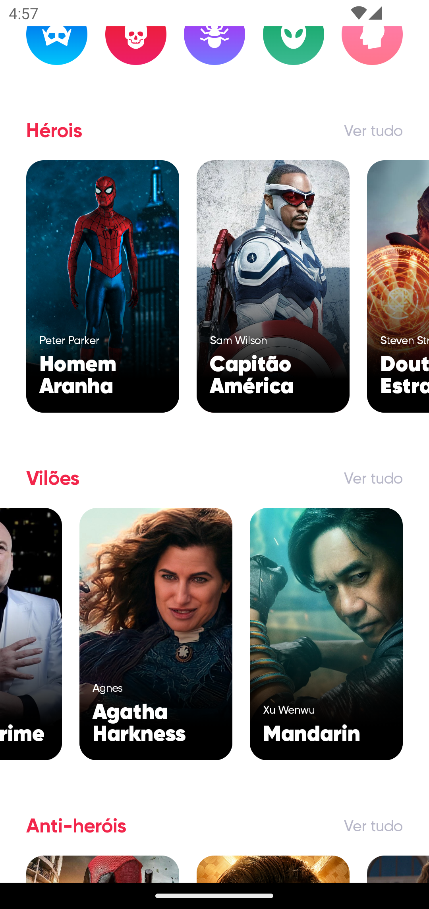
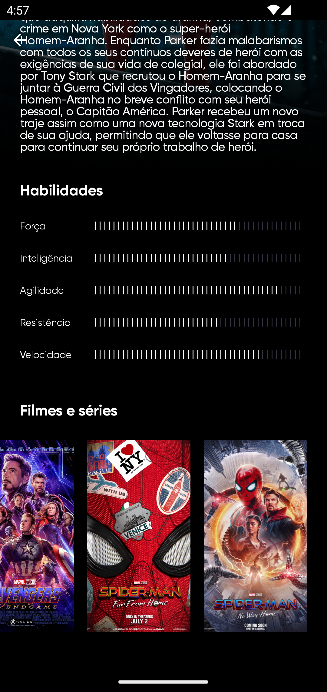
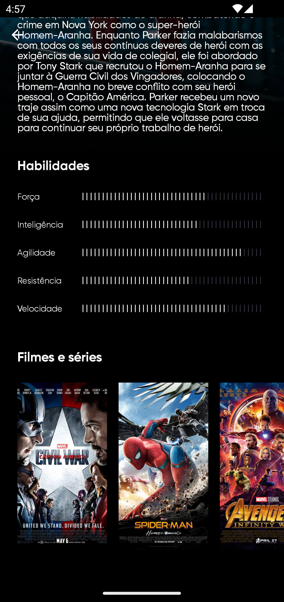

<h1 align="center">
<br>
  
<br>
<br>
Marvel Heroes App
</h1>

<p align="center">Aplicativo simples que lista personagens da Marvel e suas informações como biografia, níveis de habilidade e participações em filmes.</p>

<div>
  
</div>

# 📋 Índice

- [Telas](#-Telas)
- [Sobre o projeto](#-Sobre-o-projeto)
- [Tecnologias utilizadas](#-Tecnologias-utilizadas)
- [Rodando o projeto](#-Rodando-o-projeto)
  - [Pré-requisitos](#-Pré-requisitos)
  - [Rodando o server](#-Rodando-o-server)
  - [Rodando o aplicativo mobile](#-Rodando-o-aplicativo-mobile)

## 🎨 Telas

<p float="left">





</p>

## 📃 Sobre o projeto

Aplicativo proposto como desafio pela <bold>umpontoseis</bold> no site de desafios <bold>DevChallenge</bold> onde objetivo é desenvolver um app que liste alguns personagens da Marvel e suas caracteristicas, tudo isso seguindo o design proposto e utilizando os dados fornecidos.

A proposta do projeto surgiu em 2020 onde fiz o app em <a href="https://github.com/thiagosprestes/marvel-heroes-app">React Native</a>, agora em 2024 estou refazendo o mesmo, porém em Kotlin!

## 🛠 Tecnologias utilizadas

- K **Kotlin** — Aplicativo mobile
- 📱 **Jetpack compose** — UI
- 📡 **Retrofit** — Chamadaas para a API
- 💉 **Hilt** — Injeção de dependência
- 🛳️ **HilNavCompose** — Navegação
- 🕛 **Coroutines** — Chamadas assincronas
- 🖼️ **Coil** — Carregamento e manipulação de imagens vindas da API

## 🚀 Rodando o projeto

### Pré-requisitos

- Git
- NodeJS

Antes de rodarmos o app precisamos rodar o contéudo da pasta server, é uma pasta com estrutura simples onde estão concentrados os arquivos responsáveis por simular uma API com JSON Server

### 💻 Rodando o server

Clone o repositório

```bash

# Clona o repositório
git clone https://github.com/thiagosprestes/Marvel-heroes-kotlin.git

```

Navegue até a pasta do projeto clonado e execute os comandos abaixo

```bash

# Entra na pasta do server
cd server


# Troque a linha SEU_ENDEREÇO_DE_IP pelo endereço de IP do seu computador

# Inicia o server
npx json-server application.json --host SEU_ENDEREÇO_DE_IP -p 3333

# Acesse http://localhost:3333 para acessar o servidor caso deseje

```

### 📱 Rodando o aplicativo mobile

<ol>
  <li>Abra a pasta raiz do projeto no Android Studio</li>
  <li>Localize o arquivo `local.properties`</li>
  <li>Adicione a seguinte linha:
  BASE_URL="http://SEU_ENDEREÇO_DE_IP:3333/"
  </li>
  <li>Rode o app</li>
</ol>
